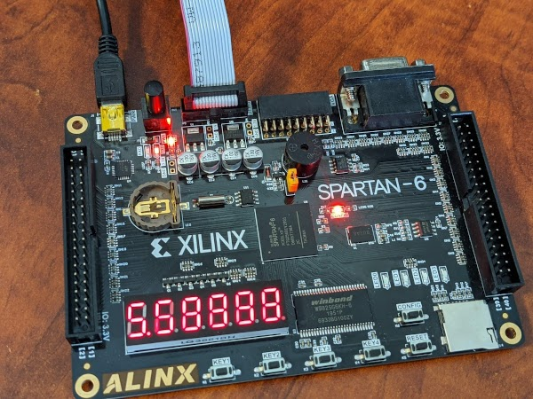

# FPGA High Resultion Timer

### Verilog code for a high resolution timer on the ALINX AX309

- Basic 6 digit timer using 7-Segment displays on the XILINX Spartan6 dev board from ALINX
- Configurable resolution, this implementation is 10 microsecond for least significant and 1 second for most significant digits.

